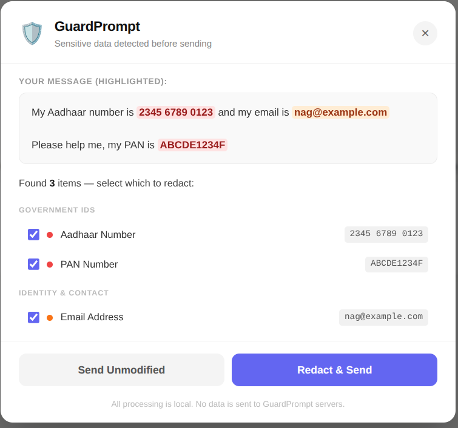

# 🛡️ GuardPrompt — AI Privacy Firewall

**Stop sensitive data from reaching AI chatbots. Locally. Instantly.**

GuardPrompt is a Chrome extension that intercepts personally identifiable information (PII) before you send it to any AI chat interface. It scans your input in real time, highlights what's sensitive, and lets you review or auto-redact before the message is sent.

**All processing is 100% local. No data ever leaves your browser.**

---

## Why GuardPrompt?

73% of employees paste sensitive data into AI chatbots without realising the risk. Aadhaar numbers, PAN cards, API keys, client names — all sent to external servers the moment you hit Enter.

GuardPrompt sits between you and the AI and catches it first.

---

## Demo

> **

---

## Features

- **Manual review overlay** — flagged items are highlighted; choose per-item what to redact before sending
- **Auto-redact mode** — silently replaces all detected PII without interrupting your flow
- **Custom keywords** — add your own: project codenames, client names, internal terms
- **Session audit log** — tracks what was redacted, when, and on which site
- **Master on/off toggle** — disable instantly from the extension popup
- **Zero data transmission** — all detection runs locally in your browser; nothing is sent to any server

---

## Supported AI Sites

| Site | Status |
|------|--------|
| claude.ai | ✅ |
| chat.openai.com | ✅ |
| chatgpt.com | ✅ |
| gemini.google.com | ✅ |
| copilot.microsoft.com | ✅ |
| perplexity.ai | ✅ |
| you.com | ✅ |
| poe.com | ✅ |

---

## PII Patterns Detected

**Identity & Contact**
- Email addresses
- Phone numbers (India +91 format)
- Phone numbers (International)

**Government IDs (India)**
- Aadhaar numbers
- PAN numbers

**Financial**
- Credit / debit card numbers
- IFSC codes

**Credentials & Secrets**
- API keys / tokens (generic)
- AWS access keys
- JWT tokens
- Inline passwords

**Network**
- Public IPv4 addresses

*Coming soon: UPI IDs, GST numbers, Voter ID, Passport numbers*

---

## Installation

### From Chrome Web Store *(coming soon)*
Search for "GuardPrompt" or follow the link once published.

### Manual install (developer mode)
```bash
git clone https://github.com/nrbandi/guardprompt.git
```
1. Open Chrome and go to `chrome://extensions`
2. Enable **Developer mode** (top right toggle)
3. Click **Load unpacked**
4. Select the `guardprompt` folder

That's it. The shield icon appears in your toolbar.

---

## How It Works

1. You type a message in any supported AI chat interface
2. When you press Enter or click Send, GuardPrompt intercepts the action
3. Your text is scanned locally using regex pattern matching — no network call is made
4. If PII is found, a review overlay appears (or auto-redact fires silently)
5. The cleaned message is sent to the AI

The extension uses Chrome MV3 architecture. Detection runs entirely in the content script — no background server, no external API.

---

## Privacy Guarantee

- **No data leaves your device.** Detection, redaction, and audit logs all run in your browser.
- **No analytics, no telemetry, no tracking.** GuardPrompt does not phone home.
- **Open source.** Every line of code is here. Verify it yourself.

See [PRIVACY.md](PRIVACY.md) for the full privacy policy.

---

## Roadmap

- [ ] UPI ID, GST number, Voter ID, Passport patterns
- [ ] Token round-trip (AI response auto-restores redacted values)
- [ ] On-device NER for name and organisation detection (Indian entities)
- [ ] Firefox port
- [ ] Local network proxy (covers desktop AI apps like Claude Code, Copilot in Word)

---

## Contributing

Contributions are welcome — especially additional PII patterns, bug fixes, and support for new AI sites.

Please read [CONTRIBUTING.md](CONTRIBUTING.md) before opening a pull request.

---

## Security

Found a vulnerability? Please do not open a public issue. Email privately so it can be fixed before disclosure. See [SECURITY.md](SECURITY.md) for the full policy.

---

## Licence

[MIT](LICENSE) © 2026 Nag (nrbandi)
